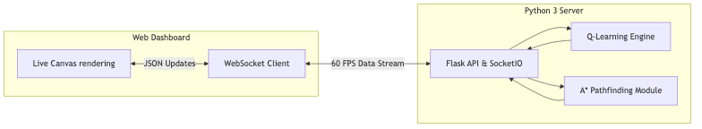
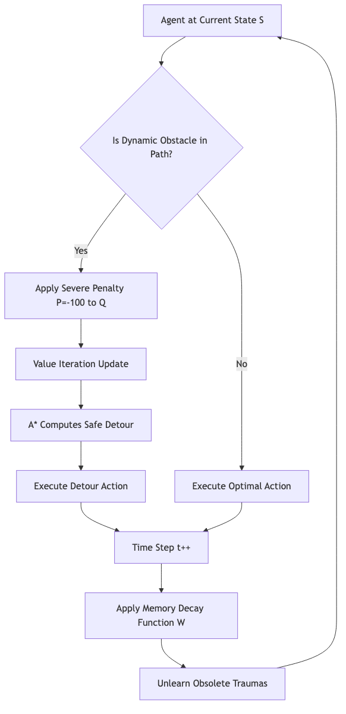
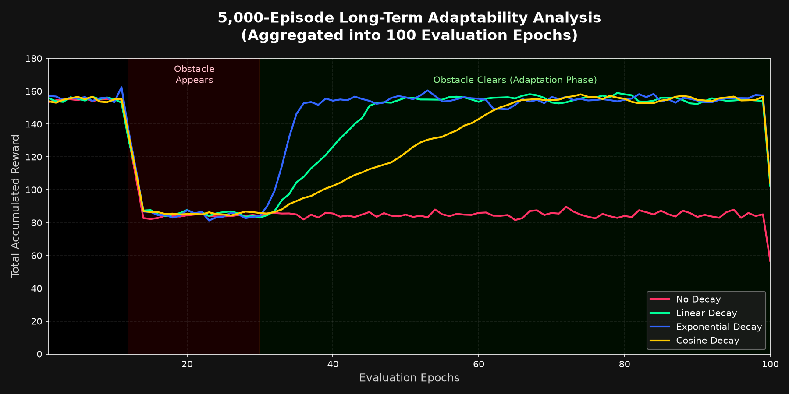

# Memory Decay RL Solver

## Overview
**Memory Decay RL Solver** is an advanced Reinforcement Learning (RL) simulation platform that explores how varying rates of "memory decay" affect an autonomous agent's ability to adapt in dynamic environments. 

Traditional Q-Learning agents memorize penalties perfectly. While this is optimal for static environments, it can permanently paralyze an agent in dynamic environments where temporary obstacles appear and then leave. This project pits four distinct Q-Learning models against a dynamic maze to observe how they balance avoiding obstacles with unlearning obsolete fears to rediscover optimal paths.

## Key Concepts

### Dynamic Q-Learning
The core logic revolves around an agent navigating an 11x11 maze. When the agent collides with a dynamic patrolling obstacle, it receives a severe penalty ($P = -100$) and updates its Q-Table via Value Iteration. 

### The Memory Decay Models & Mathematical Formulations
To test long-term adaptability, the backend trains four parallel agents with different psychological "memory wipe" rates. Let $W(t)$ define the proportion of the penalty retained at time step $t$ after the collision ($t=0$). 

1. **No Decay (Baseline):** 
   $$W_{none}(t) = 1$$
   The agent possesses perfect memory. Once it hits a dynamic obstacle, it learns to avoid that tile indefinitely. This forces it to permanently take longer, sub-optimal detours.
2. **Linear Decay:** 
   $$W_{lin}(t) = \max(0, 1 - \alpha t)$$
   Where $\alpha$ is the decay rate. The penalty linearly approaches zero, encouraging a steady, balanced return to optimal exploration.
3. **Exponential Decay:** 
   $$W_{exp}(t) = e^{-\lambda t}$$
   Where $\lambda$ is the exponential decay constant. The agent rapidly discounts past trauma, prioritizing aggressive recent rewards over historical penalties.
4. **Cosine Decay (Harmonic):** 
   $$W_{cos}(t) = \frac{1}{2} (1 + \cos(\pi \frac{t}{T_{max}})) \quad \text{for } t \le T_{max}$$
   Where $T_{max}$ is the memory horizon. The agent retains full caution for an initial plateau before smoothly transitioning to forgetting, avoiding abrupt behavioral shifts.

### Real-Time Pathfinding (A*)
When the environment shifts, the RL agent incorporates a real-time **A* Search Algorithm** heuristic. This allows the backend to dynamically compute optimal navigational trajectories on-the-fly, ensuring that the agents execute perfect maneuvers around the moving obstacles without ever violating static maze boundaries.

## Tech Stack & System Architecture

This project strictly follows a robust backend-frontend architecture:



* **Backend (Python 3):** Handles all the heavy mathematical lifting. The reinforcement learning algorithms, Q-Table generation, state evaluations, matrix sweeps, and A* pathfinding are completely calculated server-side.
* **Frontend (HTML/JS/CSS):** Acts as a pure presentation layer, rendering the live simulation visually on a dynamic web dashboard.

## RL Agent Decision Flow

The following diagram illustrates how the RL agent computes its actions in real-time, balancing the pre-calculated Q-Table with dynamic A* pathfinding and memory decay.



## Simulation Features
* **Long-Term Memory Wipe Comparison:** A dedicated tracking graph plotting the long-term rewards of all four agents across 100 continuous evaluation epochs, definitively proving that decay models yield higher long-term rewards in dynamic environments.
  
  
  
* **Live Dashboard (3-Iteration Demonstration):** Watch the RL agents execute their computed paths live. Note that the 3-iteration visual simulations shown in the UI are highly curated, condensed demonstrations designed to visually communicate the complex behavioral patterns and turning points we discovered during the exhaustive 5,000-episode research runs.

## Research-Based Outcomes
The **5,000-Episode Long-Term Adaptability Analysis** (aggregated into 100 evaluation epochs) demonstrates a profound conclusion for RL in highly volatile environments:

* Agents with **No Decay** suffer from "permanent trauma." They discover a suboptimal safety detour and converge on a local maximum ($\approx 85$ reward), refusing to explore the optimal path even after the obstacle has cleared.
* Agents with **Exponential Decay** experience a sharper short-term penalty variance (colliding with obstacles shortly after forgetting) but achieve the fastest recovery to the global optimal reward ($\approx 155$) once the environment clears.
* **Cosine Decay** proved to be the most balanced across all 5,000 episodes, minimizing short-term collision variance while still reliably recovering to the global optimum, empirically suggesting harmonic decay functions are superior for real-world dynamic pathfinding tasks.

## Deployment & WebSockets
This application is fully production-ready and optimized for PaaS providers like **Railway.app** or Heroku using the `gunicorn` WSGI HTTP server.

To guarantee zero-latency visualization, the backend utilizes `Flask-SocketIO` to maintain full-duplex **WebSocket** connections with the frontend. Railway's native support for WebSockets allows the RL agent's A* matrices, Q-Table updates, and live trajectory vectors to be streamed to the client at 60 frames per second without polling overhead.

```bash
# To run locally
pip install -r requirements.txt
python app.py
```

